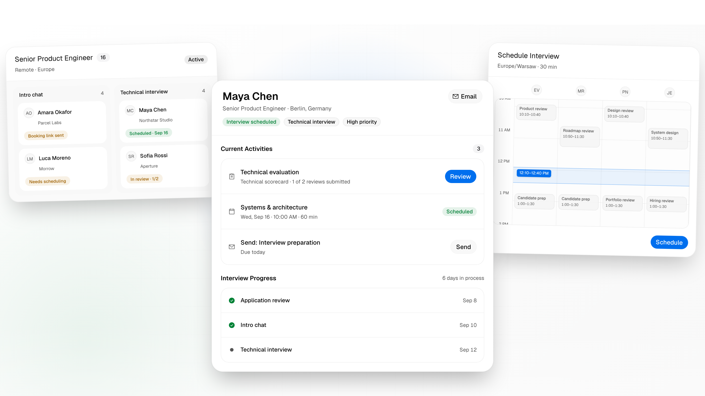
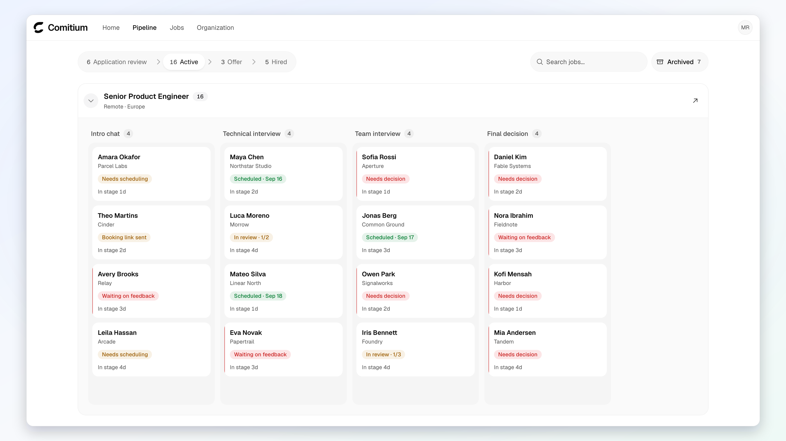
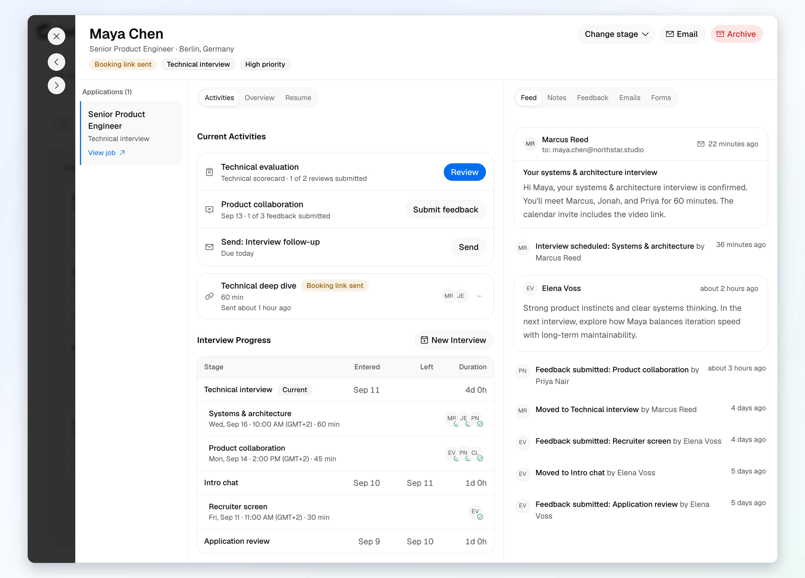
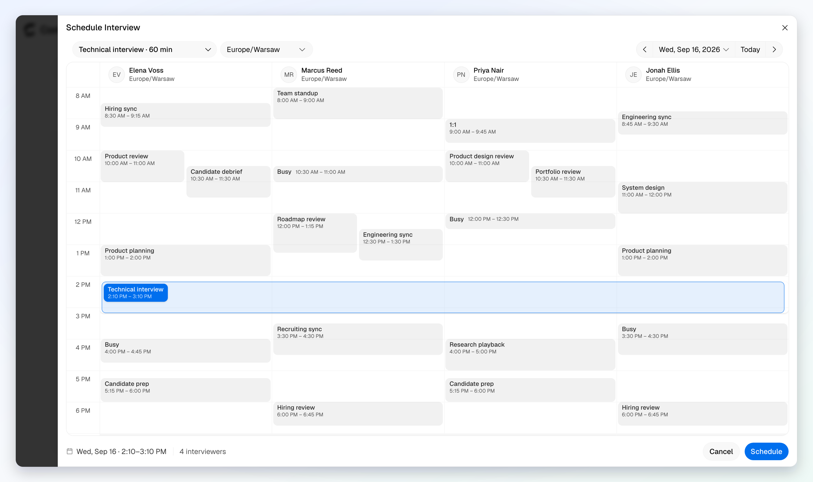

<p align="center">
  <a href="https://comitium.co">
    <picture>
      <source media="(prefers-color-scheme: dark)" srcset="docs/assets/readme/comitium-lockup-dark.png">
      <source media="(prefers-color-scheme: light)" srcset="docs/assets/readme/comitium-lockup-light.png">
      
    </picture>
  </a>
</p>

<p align="center">
  <strong>Hiring built for privacy and accountability.</strong>
</p>

<p align="center">
  <a href="https://comitium.co">Website</a>
  ·
  <a href="packages/crypto/README.md">Encryption</a>
  ·
  <a href="https://github.com/comitiumhq/contracts">Contracts</a>
</p>

<picture>
  <source media="(prefers-color-scheme: dark)" srcset="docs/assets/readme/hero-dark.png">
  <source media="(prefers-color-scheme: light)" srcset="docs/assets/readme/hero-light.png">
  
</picture>

## Features

- **Verified identity:** Zero-knowledge verification with [zkPassport](https://zkpassport.id/) to protect hiring from identity fraud and spam
- **Applicant tracking:** Job postings, application forms, candidate profiles, and Kanban/table pipeline views
- **Structured hiring:** Interview plans, stage-based activities, application reviews, scorecards, and feedback
- **Candidate management:** Notes, candidate email, forms, activity history, tags, and bulk actions
- **Interview scheduling:** Calendar integration, interviewer availability, booking links, time zones, and conflict detection
- **Candidate experience:** Job discovery, application tracking, and self-scheduling
- **Admin & access:** RBAC, team invites, custom fields, and reusable templates
- **Privacy & security:** PQ E2EE for candidate PII, organization vaults, and open-weight AI models

## Screenshots

<picture>
  <source media="(prefers-color-scheme: dark)" srcset="docs/assets/readme/pipeline-dark.png">
  <source media="(prefers-color-scheme: light)" srcset="docs/assets/readme/pipeline-light.png">
  
</picture>

<picture>
  <source media="(prefers-color-scheme: dark)" srcset="docs/assets/readme/candidate-dark.png">
  <source media="(prefers-color-scheme: light)" srcset="docs/assets/readme/candidate-light.png">
  
</picture>

<picture>
  <source media="(prefers-color-scheme: dark)" srcset="docs/assets/readme/calendar-dark.png">
  <source media="(prefers-color-scheme: light)" srcset="docs/assets/readme/calendar-light.png">
  
</picture>

## Repository

This repository contains Comitium's open-source web client.

| Path | Purpose |
| --- | --- |
| `apps/site` | Public website and job discovery |
| `apps/my` | Candidate workspace, application flow, and self-scheduling |
| `apps/app` | ATS and organization workspace |
| `packages` | Shared UI, auth, jobs, chain, schemas, and cryptography |

## Development

[Bun 1.2.19](https://bun.sh/) is required.

```bash
bun install --frozen-lockfile
bunx playwright install chromium
bun run check
bun run typecheck
bun run test --run
bun run build
```

## Security

Please report vulnerabilities privately as described in [SECURITY.md](SECURITY.md).

## License

Licensed under the [GNU General Public License v3.0 or later](LICENSE).
