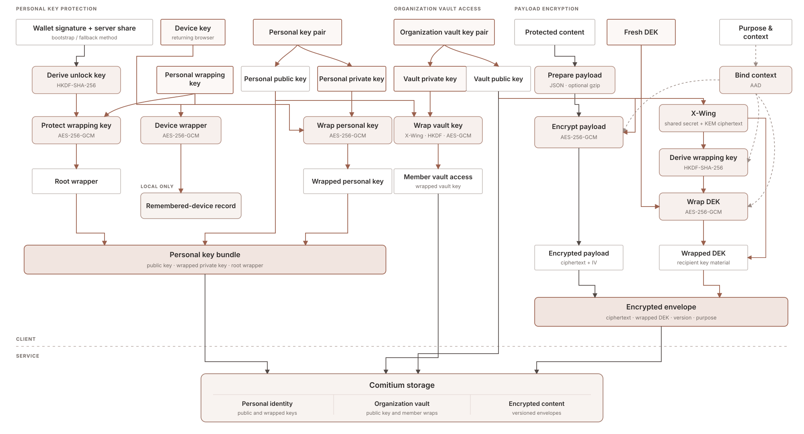

# `@comitium/crypto`

`@comitium/crypto` is Comitium's browser-side encryption package. It protects application answers, resumes and uploads, contact details, notes, feedback, and messages. Public job data and structured fields needed for search and workflows remain plaintext by design.

## Encryption model

  

Each payload is encrypted with a fresh AES-256-GCM data key. That key is wrapped with X-Wing for each allowed recipient, so authorized users can open the same content without sharing private keys.

Authenticated context binds every envelope to its purpose, organization, record, field, and recipient. Moving ciphertext to another context causes decryption to fail, and recipient policies default to deny.

## Key hierarchy

Personal and organization vault keys are generated in the browser. A member's personal key unlocks their wrapped copy of the organization vault key; the vault key protects organization content. Wallet keys never encrypt content.

A personal private key is stored only in wrapped form. Returning browsers unlock it with a remembered-device key when available, or with a wallet signature combined with a server-held share. The signature authorizes the unlock and is not sent to the Comitium API.

Comitium has no master decryption key. If every valid unlock path is lost, the encrypted data cannot be recovered.

## Runtime and primitives

Application code uses [`CryptoProxy`](src/proxy.ts). Cryptographic operations and long-lived private keys stay inside a dedicated Web Worker; decrypted values return only when needed.

Versioned envelopes use X-Wing (ML-KEM-768 and X25519), HKDF-SHA-256, and AES-256-GCM through Web Crypto and `@noble`. Supported JSON payloads may be compressed before encryption. Unsupported versions fail closed.
